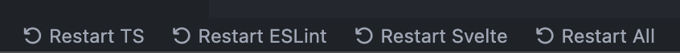
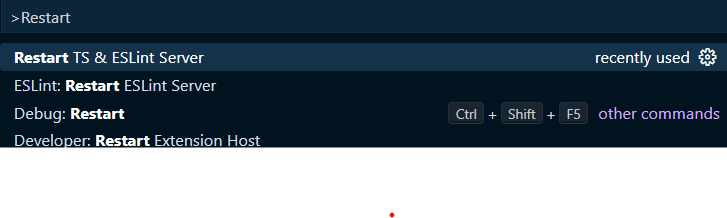

# Restart TS, ESLint, and Svelte servers

The TypeScript Language Server, ESlint, and Svelte Language Server can all become slow over long periods of usage and sometimes gets stuck when changing files outside of VS Code.

This extension adds a convenient _Restart TS_, _Restart ESLint_, _Restart Svelte_ and _Restart All_ button to the Status Bar which allows you to quickly restart them.

This extension also adds a _Restart TS/ESLint/Svelte Server_ command to the command palette (Ctrl + Shift + p)

Inspired by the [Restart Your TS Server](https://github.com/HearTao/restart-your-ts-server) extension, which does the same for touch bars.

Inspired by the [Restart TS server Status Bar button](https://github.com/qcz/vscode-restart-ts-server-button) extension.

Inspired by the [Restart TS and ESLint server](https://github.com/acoreyj/vscode-restart-ts-eslint/tree/master) extension.

## License

MIT
